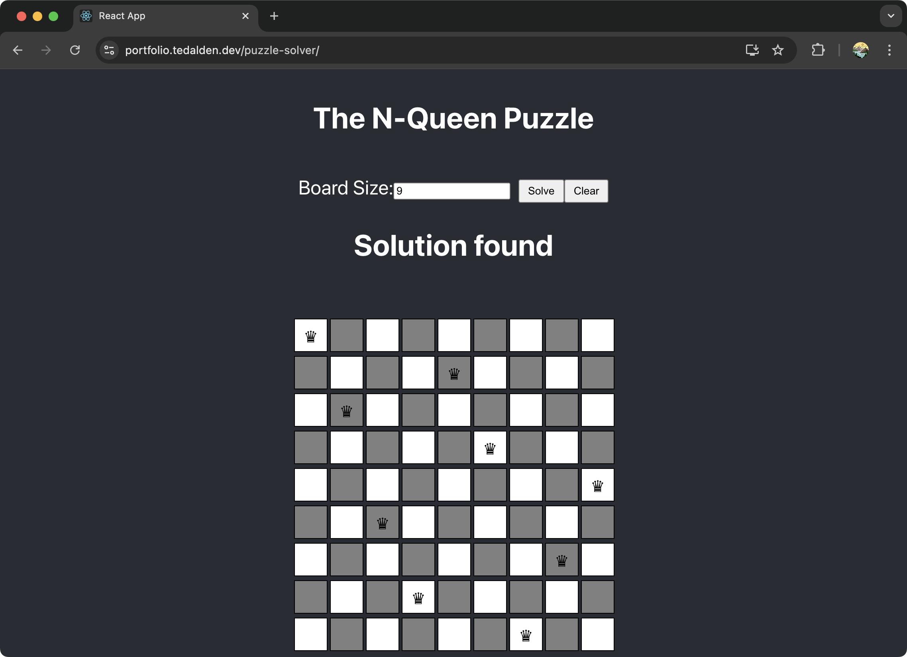

# Puzzle Solver

[![Contributors][contributors-shield]][contributors-url]
[![Forks][forks-shield]][forks-url]
[![Stargazers][stars-shield]][stars-url]
[![Issues][issues-shield]][issues-url]
[![Tests][tests-shield]][tests-url]
[![License][license-shield]][license-url]

> Puzzle-solving web application using ReactJS.

[View Demo »](https://portfolio.tedalden.dev/puzzle-solver/)

## Table of Contents

- [About the Project](#about-the-project)
    - [Built with](#built-with)
- [Prerequisites](#prerequisites)
- [Installation](#installation)
- [Usage](#usage)
    - [Run app in development mode](#run-app-in-development-mode)
    - [Build app for production](#build-app-for-production)
    - [Run Tests](#run-tests)
- [Docker Deployment](#docker-deployment)
- [Contributing](#contributing)
- [License](#license)

## About the Project

<br>
<div align="center">
  
</div>
<br>

### Built with

- ReactJS using [create-react-app](https://github.com/facebook/create-react-app).

## Prerequisites

- NodeJS `v22.5.1`
- NPM `v10.8.2`
- Git

## Installation

```bash
# Clone the repository
$ git clone https://github.com/TedAlden/puzzle-solver

# Navigate to the project directory
$ cd puzzle-solver

# Install node packages
$ npm install
```

## Usage

### Run app in development mode

```bash
# Start server in development mode
$ npm start
```

Visit the React webpage via the URL printed in your terminal: [http://localhost:3000/puzzle-solver](http://localhost:3000/puzzle-solver).

### Build app for production

```bash
# Build react app
$ npm run build
```

Host the page statically via an HTTP server.

### Run Tests

```bash
# Run unit tests
$ npm run test

# Check test coverage
$ npm run test:coverage
```

## Docker Deployment

For deployment with Docker, you can ignore the [Installation](#installation) and [Usage](#usage) steps.

You can create a docker container running the dev server, which is just the basic node React app. Use:

```bash
# Create dev container
$ docker compose -f docker-compose.dev.yml up -d
```

For deployment, it is recommended to use the production container, which builds the React app to a static site and then hosts it via an [nginx](https://nginx.org/) server. Use:

```bash
# Create production container
$ docker compose -f docker-compose.prod.yml up -d
```

## Contributing

<br>
<a href="https://github.com/TedAlden/puzzle-solver/graphs/contributors">
  
</a>
<br><br>

Currently not open to external contributors.

- [Report a bug](https://github.com/TedAlden/puzzle-solver/issues/new?assignees=&labels=bug&projects=&template=BUG-REPORT.yml&title=%F0%9F%90%9B+%5BBUG%5D+-+%3Ctitle%3E)
- [Request a feature](https://github.com/TedAlden/puzzle-solver/issues/new?assignees=&labels=question&projects=&template=FEATURE-REQUEST.yml&title=%F0%9F%92%A1+%5BREQUEST%5D+-+%3Ctitle%3E)

## License

Distributed under the MIT License. See `LICENSE.txt` for more information.

[contributors-shield]: https://img.shields.io/github/contributors/tedalden/puzzle-solver.svg?style=flat
[contributors-url]: https://github.com/tedalden/puzzle-solver/graphs/contributors
[forks-shield]: https://img.shields.io/github/forks/tedalden/puzzle-solver.svg?style=flat
[forks-url]: https://github.com/tedalden/puzzle-solver/network/members
[stars-shield]: https://img.shields.io/github/stars/tedalden/puzzle-solver.svg?style=flat
[stars-url]: https://github.com/tedalden/puzzle-solver/stargazers
[issues-shield]: https://img.shields.io/github/issues/tedalden/puzzle-solver.svg?style=flat
[issues-url]: https://github.com/tedalden/puzzle-solver/issues
[tests-shield]: https://img.shields.io/github/actions/workflow/status/TedAlden/puzzle-solver/test.yml?style=flat
[tests-url]: https://github.com/TedAlden/puzzle-solver/actions/workflows/test.yml
[license-shield]: https://img.shields.io/github/license/tedalden/puzzle-solver?style=flat
[license-url]: https://github.com/tedalden/puzzle-solver/blob/main/LICENSE.txt
